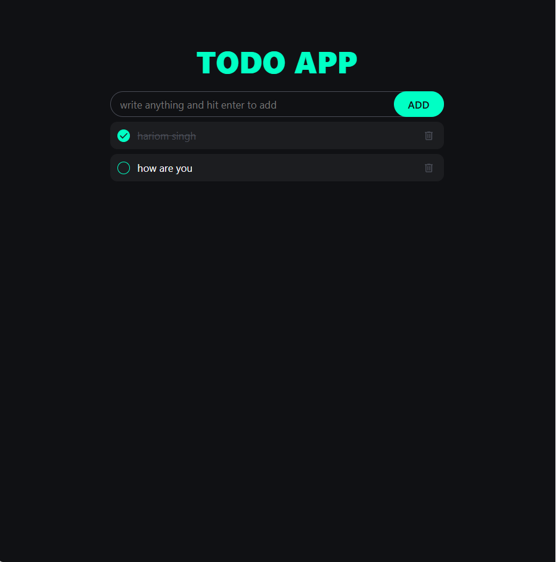

# To-Do List App 📝 

A simple, modern, and professional web application built using **HTML, CSS, and JavaScript**.  

## ✨ Features  

✅ Add new tasks  
✅ Mark tasks as completed by double clicking  
🗑 Soft delete tasks  
♻ Data saved in localStorage (persists even after page refresh)  
♻ Edit each task  
📂 Separate views for active, completed, and deleted tasks  
🎨 Clean, professional, and responsive UI  

---

## 🛠️ Technologies Used  

- Frontend: **HTML, CSS, JavaScript**  
- Version Control: **Git & GitHub**  

---

## 📌 Usage  

- ➕ **Add a task**: Type a task in the input field and click **Add**.  
- ✏️ **Edit a task**: Click the edit icon to edit text.  
- ❌ **Delete a task**: Click delete to move it to deleted tasks list.  
- 👀 **View completed tasks**: Double-click to view completed tasks.  

---

## 🔗 Click Here to Demo:  
👉 (https://hariom045418.github.io/Todo-App/)

---

## 🛠️ Built With  

- HTML  
- CSS  
- JavaScript  

---

## 📸 Preview  

  

---

## 📚 How to Use  

1. Clone the repository:  
   ```bash
   git clone https://github.com/your-username/your-repo-name.git
```
2. Open index.html in your browser.
